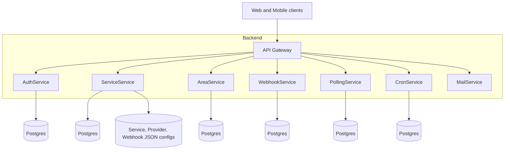
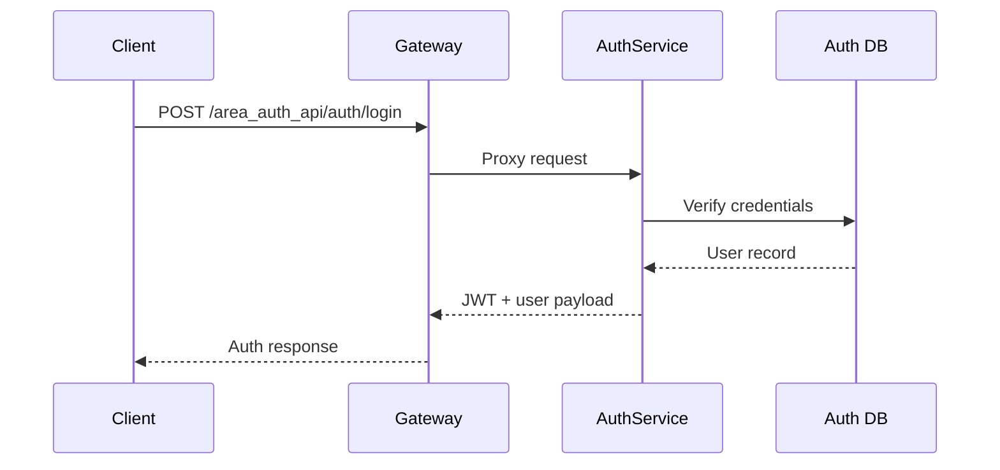
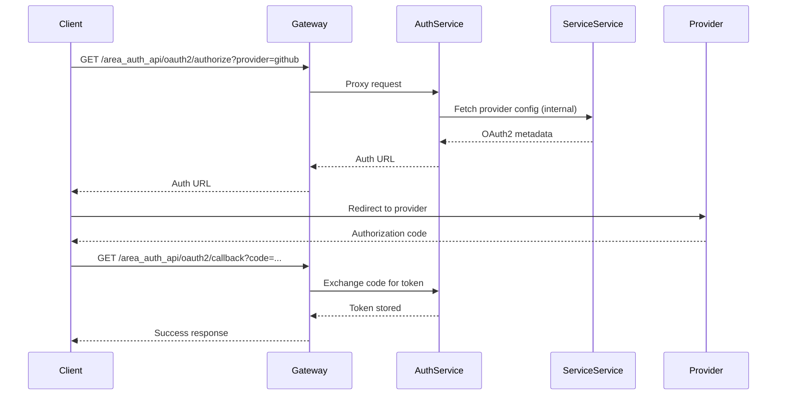
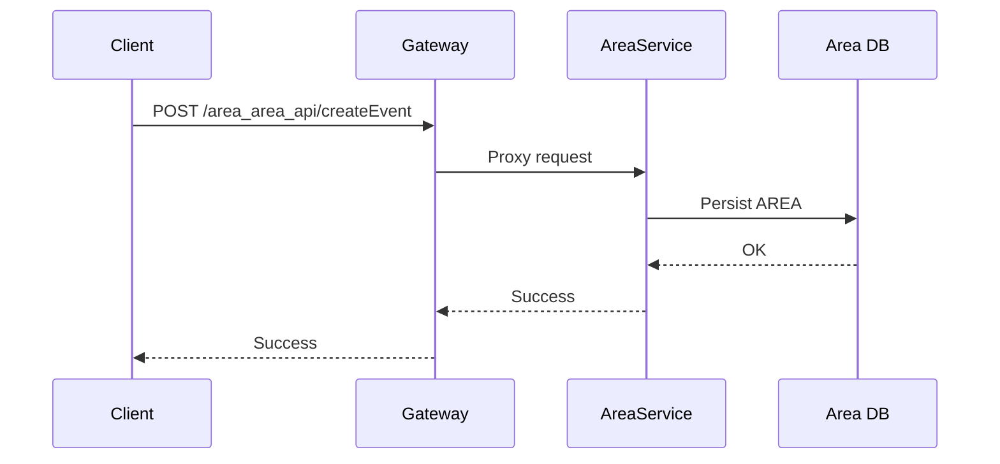

# Backend Architecture

This backend is organized as a gateway plus independent Go microservices. Each service owns its own database and configuration, while the gateway centralizes routing, auth, and policy enforcement.

## System context

## Runtime components
- **Gateway**: Single entry point. Loads route configs from `Gateway/services-config` and applies middleware (auth, permissions, internal-only, logging).
- **AuthService**: User auth, JWT issuance, OAuth2 token storage and refresh.
- **ServiceService**: Serves provider metadata, OAuth2 config, and action/reaction definitions for the UI.
- **AreaService**: Stores AREA definitions and triggers (minimal stub today).
- **WebhookService**: Manages webhook subscriptions and receives inbound events.
- **PollingService**: Polls provider APIs and RSS feeds based on config.
- **CronService**: Schedules timer-based actions.
- **MailService**: Internal SMTP sender for email reactions.

## Routing model
Routes are defined per service in `Gateway/services-config/**/service.config.json`.

- `name` defines the public prefix: `/{serviceName}{path}`.
- The gateway also accepts unprefixed routes (`{path}`) when there is no conflict.
- Internal-only routes require `X-Internal-Secret`.

For a complete list of routes and flags, see `Backend/GATEWAYS.md`.

## Configuration model
- Gateway: `Gateway/configs/gateway.env` (port, JWT, internal secret, CORS).
- Service env: `.env` per service (ports, DB credentials, upstream URLs).
- Provider, action, reaction metadata: `Services/ServiceService/app/internal/config/`.

## Request flows

### Login and token issuance

### OAuth connect flow (high level)

### Create an AREA

## Security boundaries
- **JWT validation** occurs at the gateway for routes flagged with `auth_required`.
- **Permissions** (when used) are enforced after JWT validation.
- **Internal-only** routes require `X-Internal-Secret` and are intended for service-to-service calls.
- **CORS** is configured in `gateway.env`.

## Observability
- Gateway logs request details and upstream failures.
- Each service logs independently to stdout; Docker logs are the default sink.
