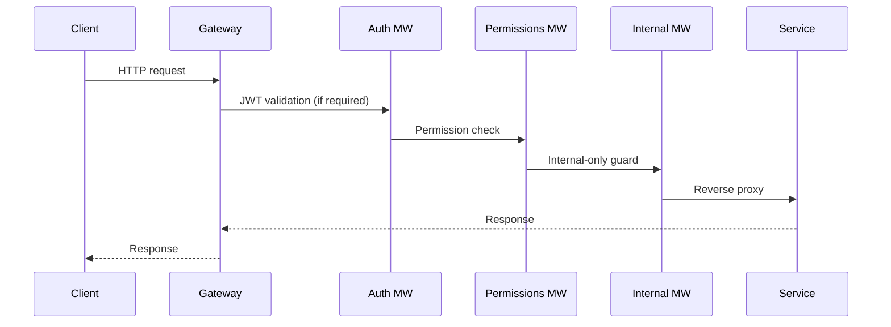

# AREA Gateway

The gateway is the single public entry point for the backend. It validates JWTs, checks permissions, enforces internal-only routes, and reverse-proxies requests to the correct microservice.

## Responsibilities
- Load service configs from `services-config/**/service.config.json`.
- Match incoming paths and methods to a route definition.
- Enforce auth, permissions, and internal-only policy.
- Proxy traffic to the target service and return responses.

## Request pipeline


## Configuration
- **Gateway env**: `configs/gateway.env`
  - `GATEWAY_PORT`, `JWT_*`, `INTERNAL_SECRET`, `ALLOWED_ORIGINS`, timeouts.
- **Service configs**: `services-config/**/service.config.json`
  - `name` defines the route prefix.
  - `base_url` points to the upstream service.
  - `routes` define methods and policies.

## Running locally
From the backend root:
```bash
cd Backend

docker compose up -d --build
```

## Routing rules
- Namespaced: `/{serviceName}{path}` where `serviceName` is the config `name`.
- Direct: `{path}` (no prefix) if there is no conflict.
- Internal-only routes require `X-Internal-Secret`.

The full route list is in:
- `Backend/Gateway/GATEWAYS.md`
- `Backend/GATEWAYS.md`
