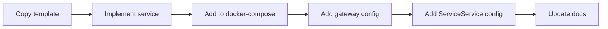

# Backend Contribution Guide

This guide covers how to run the backend locally and how to extend services, actions, and reactions.

## Prerequisites
- Go 1.22+
- Docker and Docker Compose
- Make (optional but handy)

## Local setup
```bash
cd Backend

docker network create area_network || true

cp Services/AuthService/.env.example Services/AuthService/.env
cp Services/ServiceService/.env.example Services/ServiceService/.env
cp Services/AreaService/.env.example Services/AreaService/.env

make docker-up
```

## Development loop
- Format Go code: `gofmt -w .`
- Run tests: `go test ./...`
- Update OpenAPI docs when routes change.

## Add a new service


1. **Copy the template**
   ```bash
   cp -r Backend/Template/Microservice Backend/Services/MyService
   ```
2. **Update service metadata**
   - `app/go.mod` module path
   - `openapi.yaml` routes and schemas
   - `.env.example` defaults
3. **Wire it into Docker**
   - Add a new service and database in `Backend/docker-compose.yml`.
   - Pick a unique API port and DB port.
4. **Register routes in the gateway**
   - Create `Backend/Gateway/services-config/my-service/service.config.json`:
     ```json
     {
       "name": "my_service_api",
       "base_url": "http://my_service_api:8090",
       "routes": [
         {
           "path": "/health",
           "methods": ["GET"],
           "auth_required": false,
           "internal_only": false
         }
       ]
     }
     ```
5. **Expose actions and reactions (if relevant)**
   - Add a config file in `Backend/Services/ServiceService/app/internal/config/services/`.
   - See existing files such as `github.json` or `google_calendar.json` for examples.
6. **Update docs**
   - Add the service to `Backend/README.md` and `Backend/GATEWAYS.md`.

## Add a new action
Actions are defined in ServiceService config files under:
`Backend/Services/ServiceService/app/internal/config/services/*.json`.

1. Open the service file (example: `github.json`).
2. Add an entry under `actions` with:
   - `title`, `label`, `type`
   - `fields` (input form schema)
   - `output_fields` (data emitted by the action)
3. If `type` is `webhook`, update the provider config in:
   `Backend/Services/ServiceService/app/internal/config/webhooks/<provider>.json`
4. Validate:
   ```bash
   curl "http://localhost:8080/area_service_api/services/service-config?service=github"
   ```

## Add a new reaction
Reactions are also defined in:
`Backend/Services/ServiceService/app/internal/config/services/*.json`.

1. Add an entry under `reactions` with:
   - `title`, `label`, `url`, `method`
   - `fields` for user input
   - `bodyType` and `body_struct` for request payload mapping
2. Ensure the provider OAuth config exists in:
   `Backend/Services/ServiceService/app/internal/config/providers/`
3. Make sure AuthService has the provider credentials in `.env`.
4. Validate the config endpoint as above.

## Conventions
- Keep service configs validated (the loader enforces required fields).
- Prefer adding new routes to OpenAPI files for each service.
- Update gateway route tables when you change routes.
