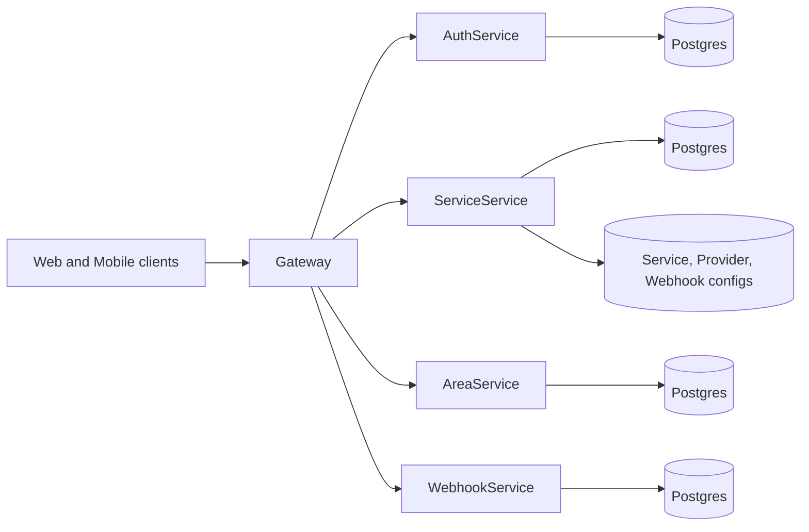

# AREA Backend

The backend is a Go microservice stack fronted by a single API gateway. All client traffic (web and mobile) should go through the gateway, which validates auth, permissions, and internal-only routes before proxying to services.

## Architecture at a glance


## Services
| Service | Responsibility | Default port | Notes |
| --- | --- | --- | --- |
| Gateway | Routing, JWT validation, permissions, internal-only protection | 8080 | Loads `Gateway/services-config/**/service.config.json` |
| AuthService | Auth, JWT issuance, OAuth2 token handling | 8083 | Postgres on 5433 by default |
| ServiceService | Provider catalog and action/reaction metadata | 8084 | Postgres on 5434 by default |
| AreaService | AREA creation and automation data | 8085 | Postgres on 5435 by default |
| WebhookService | Webhook subscriptions and inbound webhook receiver | 8086 | Optional, not started by root compose |

## Directory layout
```
Backend/
|-- Gateway/            # API gateway (Go) + service configs
|-- Services/           # Individual microservices
|   |-- AuthService/
|   |-- ServiceService/
|   |-- AreaService/
|   `-- WebhookService/
|-- Template/           # Microservice starter
|-- services.yaml       # High-level service catalog (example)
`-- docker-compose.yml  # Root compose for gateway + core services
```

## Quick start (Docker)
```bash
cd Backend

# Seed env files if missing
cp Services/AuthService/.env.example Services/AuthService/.env
cp Services/ServiceService/.env.example Services/ServiceService/.env
cp Services/AreaService/.env.example Services/AreaService/.env

# Launch gateway + core services + their DBs
docker compose up -d --build

# Shut everything down (and drop DB volumes)
docker compose down -v
```
Default host ports:
- Gateway: `8080`
- AuthService: `8083` (Postgres `5433`)
- ServiceService: `8084` (Postgres `5434`)
- AreaService: `8085` (Postgres `5435`)

If you want to run WebhookService, start it separately from `Backend/Services/WebhookService` and align its `SERVER_PORT` with the gateway config.

## Running a single service manually
Each service ships with:
- `Dockerfile` and `docker-compose.yml` (maps `${SERVER_PORT}` to the host).
- `.env.example` to seed required variables.
- `Makefile` for `make run`, `make test`, `make docker-up`, etc.

Example (AuthService):
```bash
cd Backend/Services/AuthService
cp .env.example .env

docker compose up -d
```

## Gateway routing basics
- The gateway loads routes from `Gateway/services-config/**/service.config.json`.
- Public routes can be called as either:
  - Namespaced: `/{serviceName}{path}`
  - Direct: `{path}` (no prefix, if no conflicts)
- `serviceName` comes from the `name` field in each service config. Current configs include:
  - `area_auth_api`
  - `area_service_api`
  - `area_area_api`
  - `area_webhook_api`

Internal-only routes require the `X-Internal-Secret` header (see `Gateway/configs/gateway.env`).

All routes and flags are listed in `Backend/GATEWAYS.md`.

## Configuration surface
- Gateway: `Backend/Gateway/configs/gateway.env`
  - `GATEWAY_PORT`, `INTERNAL_SECRET`, `JWT_*`, `ALLOWED_ORIGINS`, timeouts.
- Service env: `.env` files per service under `Backend/Services/*`.
- Service routing: `Backend/Gateway/services-config/**/service.config.json`.
- Provider and action/reaction metadata: `Backend/Services/ServiceService/app/internal/config/**`.

## Documentation
- Backend architecture: `Backend/ARCHITECTURE.md`
- Backend contribution guide: `Backend/HOWTOCONTRIBUTE.md`
- Gateway route catalog: `Backend/GATEWAYS.md`
- Gateway implementation notes: `Backend/Gateway/README.md`
