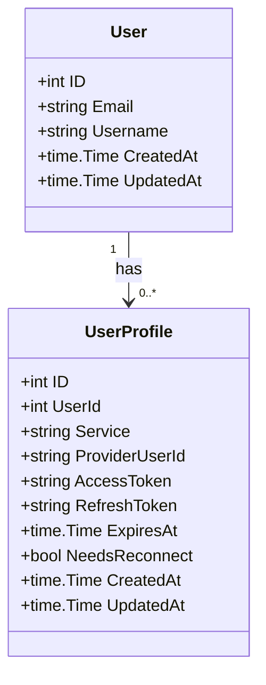
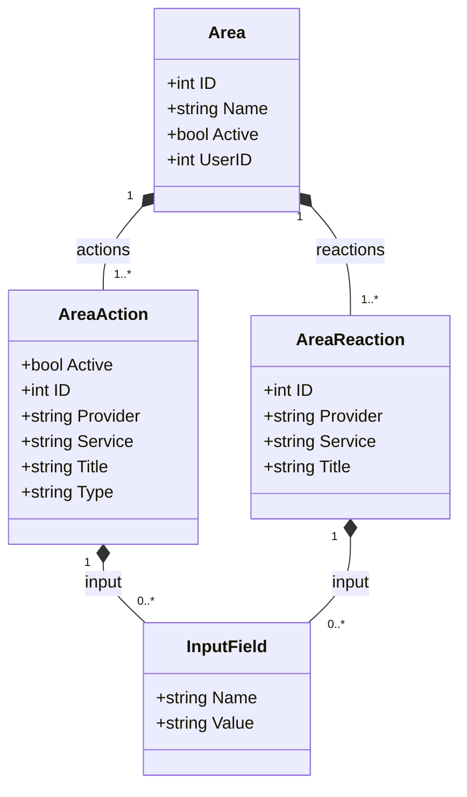

# Class Diagrams

These diagrams document core domain models used by the backend services.

## AuthService Domain

```mermaid
classDiagram
  class User {
    +int ID
    +string Email
    +string Username
    +time.Time CreatedAt
    +time.Time UpdatedAt
  }

  class UserProfile {
    +int ID
    +int UserId
    +string Service
    +string ProviderUserId
    +string AccessToken
    +string RefreshToken
    +time.Time ExpiresAt
    +bool NeedsReconnect
    +time.Time CreatedAt
    +time.Time UpdatedAt
  }

  User "1" --> "0..*" UserProfile : has
```

## AreaService Domain

```mermaid
classDiagram
  class Area {
    +int ID
    +string Name
    +bool Active
    +int UserID
  }

  class AreaAction {
    +bool Active
    +int ID
    +string Provider
    +string Service
    +string Title
    +string Type
  }

  class AreaReaction {
    +int ID
    +string Provider
    +string Service
    +string Title
  }

  class InputField {
    +string Name
    +string Value
  }

  Area "1" *-- "1..*" AreaAction : actions
  Area "1" *-- "1..*" AreaReaction : reactions
  AreaAction "1" *-- "0..*" InputField : input
  AreaReaction "1" *-- "0..*" InputField : input
```
