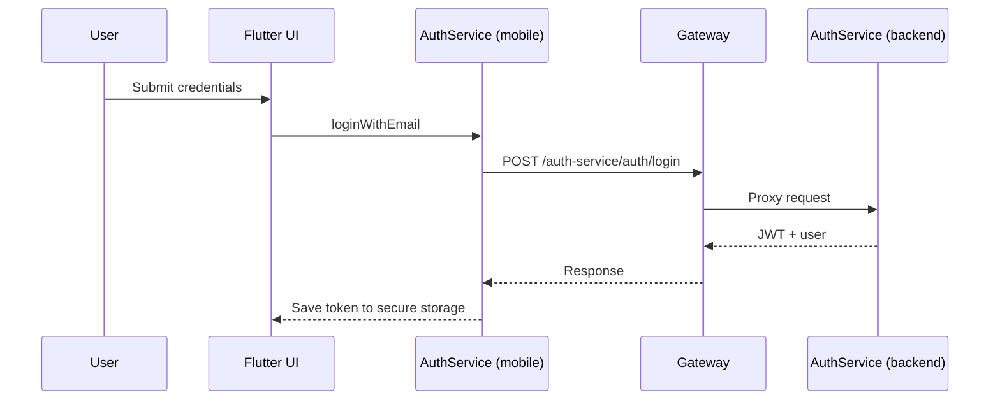

# Mobile Architecture (Flutter)

The mobile app is built around a clean separation between UI screens, providers, and API services. Network calls are isolated in service classes, while UI screens remain focused on rendering and user interaction.

## Layered structure
- `lib/screens/`: UI pages (auth, services, profile, main shell).
- `lib/providers/`: state management (`AuthProvider`).
- `lib/services/`: HTTP and OAuth helpers (`AuthService`, `ServiceConnector`).
- `lib/models/`: client-side models.
- `lib/theme/`: colors, typography, and theme.

## Data flow

## Auth and session flow

## OAuth deep links
- The app listens for deep links with the scheme/host `area://auth`.
- Android intent filter is defined in `android/app/src/main/AndroidManifest.xml`.
- OAuth login uses `app_links` to capture the redirect and store the token.

## Configuration
- Base URL comes from `.env` (`BASE_URL`).
- Most routes are built as `$BASE_URL/auth-service/...` in `lib/services/*`.

## Error handling
- Service methods throw exceptions with readable messages.
- UI layers catch and display errors via banners or dialogs.
