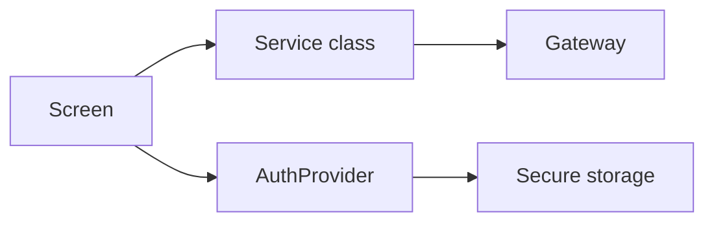

# Create a Backend-Linked Screen (Mobile)

This guide shows how to add a new screen that reads or writes data through the backend gateway.

## High-level flow


## 1. Define a model
Create `lib/models/area_model.dart` (example):
```dart
class AreaModel {
  final String id;
  final String name;

  AreaModel({required this.id, required this.name});

  factory AreaModel.fromJson(Map<String, dynamic> json) {
    return AreaModel(
      id: json['id'].toString(),
      name: json['name'] as String,
    );
  }
}
```

## 2. Add a service method
Add to a service in `lib/services/` (or create a new one):
```dart
import 'dart:convert';
import 'package:http/http.dart' as http;
import 'package:flutter_dotenv/flutter_dotenv.dart';
import 'package:flutter_secure_storage/flutter_secure_storage.dart';
import '../models/area_model.dart';

class AreaService {
  final String baseUrl = dotenv.env['BASE_URL'] ?? 'http://localhost:8080';
  final _storage = const FlutterSecureStorage();

  Future<List<AreaModel>> listAreas() async {
    final token = await _storage.read(key: 'jwt_token');
    if (token == null || token.isEmpty) {
      throw Exception('Missing token');
    }

    final uri = Uri.parse('$baseUrl/area-service/getAreas');
    final response = await http.get(
      uri,
      headers: { 'Authorization': 'Bearer $token' },
    );

    if (response.statusCode != 200) {
      throw Exception('Failed to load areas');
    }

    final data = jsonDecode(response.body) as Map<String, dynamic>;
    final items = data['data'] as List<dynamic>? ?? [];
    return items.map((item) => AreaModel.fromJson(item)).toList();
  }
}
```

## 3. Build the screen
`lib/screens/area/areas_list_screen.dart`
```dart
import 'package:flutter/material.dart';
import '../../services/area_service.dart';

class AreasListScreen extends StatefulWidget {
  const AreasListScreen({super.key});

  @override
  State<AreasListScreen> createState() => _AreasListScreenState();
}

class _AreasListScreenState extends State<AreasListScreen> {
  late final AreaService _service;
  var _loading = true;
  var _items = <dynamic>[];

  @override
  void initState() {
    super.initState();
    _service = AreaService();
    _load();
  }

  Future<void> _load() async {
    try {
      final areas = await _service.listAreas();
      setState(() {
        _items = areas;
      });
    } finally {
      setState(() {
        _loading = false;
      });
    }
  }

  @override
  Widget build(BuildContext context) {
    if (_loading) {
      return const Center(child: CircularProgressIndicator());
    }

    return ListView.builder(
      itemCount: _items.length,
      itemBuilder: (context, index) {
        return ListTile(title: Text(_items[index].name));
      },
    );
  }
}
```

## 4. Wire navigation
- Add a route in `lib/main.dart` or a new tab entry in `lib/screens/main_shell.dart`.
- Use `Navigator.pushNamed` or update the bottom nav list.

## 5. Keep docs updated
- Update `README.md` and `ARCHITECTURE.md` if the app structure changes.

## Gateway alignment note
This app uses paths like `/auth-service` and `/area-service`. If your gateway uses different prefixes (for example `area_auth_api`), update the service URLs accordingly.
