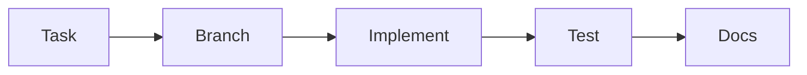

# Mobile Contribution Guide (Flutter)

This guide explains how to work on the Flutter app and keep contributions consistent.

## Workflow overview


## Prerequisites
- Flutter SDK (stable)
- Dart SDK (bundled with Flutter)
- Android Studio or Xcode for device/emulator

## Local setup
```bash
cd Mobile/area_mobile
flutter pub get
flutter run
```

## Code organization rules
- UI screens go in `lib/screens/`.
- Network calls live in `lib/services/`.
- State lives in `lib/providers/`.
- Keep models in `lib/models/`.

## Add a new screen
1. Create a screen file under `lib/screens/<feature>/<feature>_screen.dart`.
2. Add navigation:
   - For tab pages, update `lib/screens/main_shell.dart`.
   - For routed pages, add a route in `lib/main.dart`.
3. Add API calls in `lib/services/`.
4. Use `AuthProvider` to access the user token where needed.

For a full backend-linked example, see:
`Mobile/area_mobile/CREATE_BACKEND_PAGE.md`.

## Testing
- Unit tests: `flutter test`
- Smoke test on emulator for auth and services flows.

## Documentation
- Keep `README.md` and `ARCHITECTURE.md` in sync with new screens or flows.
