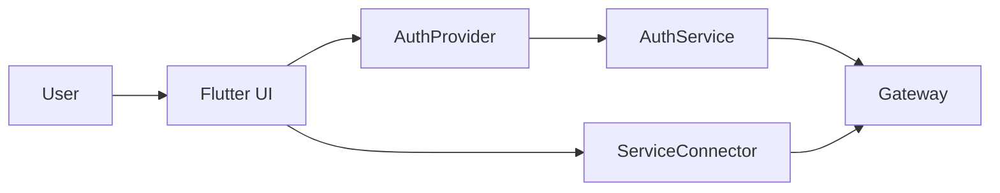

# AREA Mobile App (Flutter)

A Flutter client for browsing services, authenticating users, and launching OAuth flows. The app talks to backend APIs through the gateway.

## Architecture snapshot


## Highlights
- Email/password login and signup, plus OAuth login.
- Service catalog with connect flow via OAuth.
- Bottom navigation shell (Dashboard, AREA, Services, Profile).
- Secure token storage with `flutter_secure_storage`.

## Project structure
```
lib/
|-- main.dart          # App entry, Provider setup, routing
|-- providers/         # AuthProvider (session state + secure storage)
|-- services/          # AuthService, ServiceConnector (HTTP + OAuth helpers)
|-- screens/           # UI screens (auth, services, profile, shell)
|-- models/            # ServiceModel (provider data)
`-- theme/             # Colors, typography, theme
```

## Configuration
Create `Mobile/area_mobile/.env`:
```bash
BASE_URL=http://10.0.2.2:8080
```
Notes:
- Android emulator uses `10.0.2.2` to reach your host.
- This app currently builds URLs like `$BASE_URL/auth-service/...`.
  Ensure the gateway exposes `/auth-service` or update the base URL logic in `lib/services/*`.

## Run locally
```bash
cd Mobile/area_mobile
flutter pub get
flutter run
```

## Testing and release
- Tests: `flutter test`
- Android: `flutter build apk --release`
- iOS: `flutter build ios --release`

## Docs
- Architecture: `Mobile/area_mobile/ARCHITECTURE.md`
- Contribution guide: `Mobile/area_mobile/HOWTOCONTRIBUTE.md`
- Create a backend-linked screen: `Mobile/area_mobile/CREATE_BACKEND_PAGE.md`
