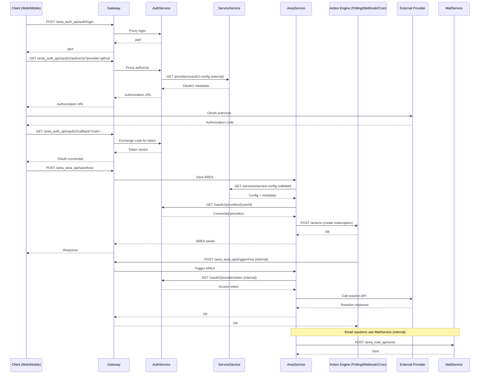

# AREA Sequence Diagram

This sequence diagram shows the main flow for authentication, provider connection, AREA creation, and action triggering.

```mermaid
sequenceDiagram
  participant C as Client (Web/Mobile)
  participant G as Gateway
  participant Auth as AuthService
  participant Svc as ServiceService
  participant Area as AreaService
  participant Engine as Action Engine (Polling/Webhook/Cron)
  participant Prov as External Provider
  participant Mail as MailService

  C->>G: POST /area_auth_api/auth/login
  G->>Auth: Proxy login
  Auth-->>G: JWT
  G-->>C: JWT

  C->>G: GET /area_auth_api/oauth2/authorize?provider=github
  G->>Auth: Proxy authorize
  Auth->>Svc: GET /providers/oauth2-config (internal)
  Svc-->>Auth: OAuth2 metadata
  Auth-->>G: Authorization URL
  G-->>C: Authorization URL
  C->>Prov: OAuth authorize
  Prov-->>C: Authorization code
  C->>G: GET /area_auth_api/oauth2/callback?code=...
  G->>Auth: Exchange code for token
  Auth-->>G: Token stored
  G-->>C: OAuth connected

  C->>G: POST /area_area_api/saveArea
  G->>Area: Save AREA
  Area->>Svc: GET /services/service-config (validate)
  Svc-->>Area: Config + metadata
  Area->>Auth: GET /oauth2/providers/{userId}
  Auth-->>Area: Connected providers
  Area->>Engine: POST /actions (create subscription)
  Engine-->>Area: OK
  Area-->>G: AREA saved
  G-->>C: Response

  Engine->>G: POST /area_area_api/triggerArea (internal)
  G->>Area: Trigger AREA
  Area->>Auth: GET /oauth2/provider/token (internal)
  Auth-->>Area: Access token
  Area->>Prov: Call reaction API
  Prov-->>Area: Reaction response
  Area-->>G: OK
  G-->>Engine: OK

  Note over Area,Mail: Email reactions use MailService (internal)
  Area->>Mail: POST /area_mail_api/send
  Mail-->>Area: Sent
```
