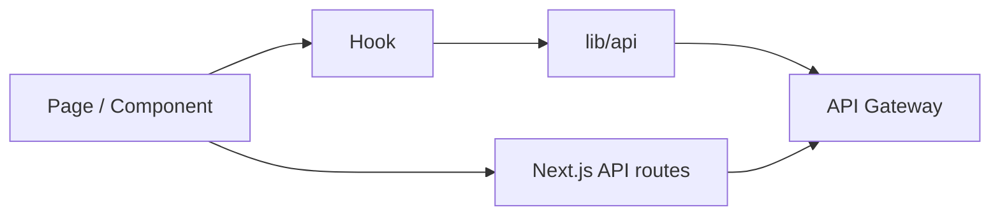

# Frontend Architecture (Next.js App Router)

This frontend keeps UI, client logic, and network access in separate layers so data access stays predictable and easy to test.

## Layered structure
- `src/app/`: App Router pages and API routes.
- `src/components/`: UI-only components.
- `src/hooks/`: Reusable client logic (auth, OAuth callbacks).
- `src/lib/`: API clients and helpers.
- `src/types/`: Shared types and contracts.
- `public/`: Static assets.

## Data flow

### Notes
- Pages should not embed raw `fetch` calls. Use `lib/api` or a hook.
- API routes under `src/app/api/**/route.ts` are thin proxies that can set cookies and hide secrets.

## Auth and session handling
- `useAuth` manages login, register, and logout flows.
- `/api/session` is used to store the HTTP-only session cookie when required.
- OAuth callbacks are handled by `useOAuthCallback` in the client.

## Backend integration contracts
- `lib/api/auth.ts` defines the auth base URL and normalizes `/auth-service`.
- `lib/api/area.ts` and `lib/api/services.ts` derive their base URLs from the auth base.
- Update `src/types/` when backend payloads change.

## Rendering model
- Default pages are server components.
- Add `"use client"` when using hooks or browser APIs.
- Use `cache: "no-store"` for auth-sensitive requests.

## Configuration
Set these in `Web/frontend/.env.local`:
- `API_BASE_URL` and `NEXT_PUBLIC_API_BASE_URL`
- `AREA_API_BASE_URL` and `NEXT_PUBLIC_AREA_API_BASE_URL`
- `SERVICES_API_BASE_URL` and `NEXT_PUBLIC_SERVICES_API_BASE_URL`
- `NEXT_PUBLIC_SITE_URL`, `NEXT_PUBLIC_OAUTH_CALLBACK_BASE`, `COOKIE_SECURE`
