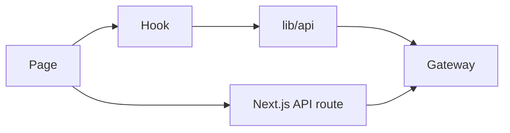

# Create a Backend-Linked Page (Web)

This guide walks through adding a new page that calls backend APIs via the gateway.

## High-level flow


## 1. Add or extend an API client
Create a helper in `src/lib/api/<feature>.ts`:
```ts
import { AREA_SERVICE_BASE_URL } from "@/lib/api/area";

export async function listAreas(token: string) {
  const response = await fetch(`${AREA_SERVICE_BASE_URL}/getAreas`, {
    headers: { Authorization: `Bearer ${token}` },
    cache: "no-store",
  });

  if (!response.ok) {
    throw new Error("Failed to load areas.");
  }

  return (await response.json()) as unknown;
}
```

## 2. Optional: add a Next.js API route
Use API routes when you need cookies or server-side secrets:
`src/app/api/areas/route.ts`
```ts
import { NextResponse } from "next/server";
import { cookies } from "next/headers";
import { listAreas } from "@/lib/api/areas";

export async function GET() {
  const token = cookies().get("session")?.value;
  if (!token) {
    return NextResponse.json({ error: "Unauthorized" }, { status: 401 });
  }

  const data = await listAreas(token);
  return NextResponse.json({ data });
}
```

## 3. Add a hook (recommended)
`src/hooks/useAreas.ts`
```ts
import { useEffect, useState } from "react";
import { useAuth } from "@/hooks/useAuth";
import { listAreas } from "@/lib/api/areas";

export function useAreas() {
  const { user } = useAuth();
  const [areas, setAreas] = useState<unknown[]>([]);

  useEffect(() => {
    if (!user?.token) return;
    listAreas(user.token).then(setAreas).catch(() => setAreas([]));
  }, [user?.token]);

  return { areas };
}
```

## 4. Create the page
`src/app/areas/page.tsx`
```tsx
"use client";

import { useAreas } from "@/hooks/useAreas";

export default function AreasPage() {
  const { areas } = useAreas();

  return (
    <main>
      <h1>Areas</h1>
      <pre>{JSON.stringify(areas, null, 2)}</pre>
    </main>
  );
}
```

## 5. Update docs and routes
- Add the route to `Web/frontend/PAGES_ROUTES.md`.
- If the page is part of the main navigation, update the relevant navigation component.

## Gateway alignment note
The web client expects gateway prefixes like `/auth-service`, `/area-service`, and `/service-service`.
If your gateway uses different prefixes (for example `area_auth_api`), update the gateway config or the base URL normalization in `src/lib/api/*.ts`.
