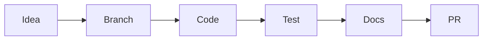

# Frontend Contribution Guide (Web)

This guide explains how to work on the Next.js frontend and how to add new pages cleanly.

## Workflow overview

## Prerequisites
- Node.js 18.18+ (20 recommended)
- npm (lockfile present)
- Backend gateway reachable (default `http://localhost:8080`)

## Dev loop
1. Install deps: `npm install`
2. Start dev server: `npm run dev` (http://localhost:8081)
3. Before pushing: `npm run lint` and ideally `npm run build`

## Add or modify a component
- Place UI-only components in `src/components/`.
- Keep network calls in `src/lib/api` or hooks in `src/hooks`.
- Reuse existing primitives (`Button`, `Card`, `AreaCard`, `ServiceCard`, `AreaNavigation`).
- Add public components to `Web/frontend/COMPONENTS.md`.

## Add a new page or route
- Create a folder under `src/app/<route>/page.tsx` (App Router).
- If the page uses hooks or client state, add `"use client"`.
- For shared navigation, import `AreaNavigation`.
- Document new routes in `Web/frontend/PAGES_ROUTES.md`.

For a full backend-linked page walkthrough, see:
`Web/frontend/CREATE_BACKEND_PAGE.md`.

## Backend integration rules
- Use `src/lib/api/*` for external requests.
- Prefer `src/app/api/*` routes when you need to manage cookies or hide secrets.
- Keep auth-sensitive requests `cache: "no-store"`.

## Quick manual checks
- Auth: login/register redirects to `/area`.
- Services: provider list loads and OAuth connect launches.
- AREA: creation flow triggers the backend call.
- Profile: user data loads, logout clears session.

## Documentation updates
- Update `README.md` and `ARCHITECTURE.md` when structure or env changes.
- Update `COMPONENTS.md` and `PAGES_ROUTES.md` when UI or routes change.
