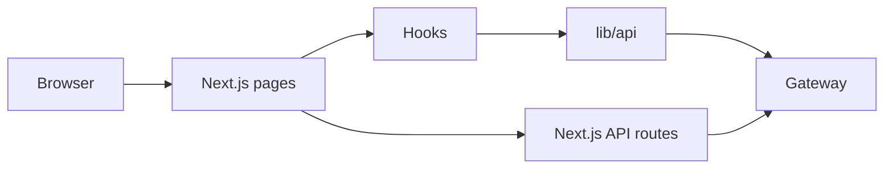

# AREA Web Frontend (Next.js)

The web client for browsing services, connecting providers, and building AREAs. It uses Next.js App Router with a clean separation between UI, hooks, and API access.

## Architecture snapshot


## Stack
- Next.js 16 (App Router) + React 19 + TypeScript
- Tailwind CSS 4, CSS variables in `globals.css`
- Zod for client-side validation
- Dockerfile and docker-compose for container builds

## Project layout
```
src/
  app/                # Routes and API routes (App Router)
    area/             # AREA builder
    services/         # Provider catalog
    login, register   # Auth pages
    profil/           # User profile
    auth/callback/    # OAuth callback
    api/              # Server routes (session/auth proxies)
  components/         # UI-only components
  hooks/              # Auth and OAuth hooks
  lib/                # API clients and helpers
  types/              # Shared types
public/               # Static assets
```

## Configuration (gateway alignment)
Create `Web/frontend/.env.local`:
```bash
API_BASE_URL=http://localhost:8080/auth-service
NEXT_PUBLIC_API_BASE_URL=$API_BASE_URL

AREA_API_BASE_URL=http://localhost:8080/area-service
NEXT_PUBLIC_AREA_API_BASE_URL=$AREA_API_BASE_URL

SERVICES_API_BASE_URL=http://localhost:8080/service-service
NEXT_PUBLIC_SERVICES_API_BASE_URL=$SERVICES_API_BASE_URL

NEXT_PUBLIC_SITE_URL=http://localhost:3000
NEXT_PUBLIC_OAUTH_CALLBACK_BASE=http://localhost:3000
COOKIE_SECURE=false
```
Notes:
- The frontend normalizes base URLs to `/auth-service`, `/area-service`, and `/service-service`.
- If your gateway uses different prefixes (for example `area_auth_api`), update the gateway service config names or adjust the normalization logic in `src/lib/api/*.ts`.
- When running via Docker, the server side may need `http://host.docker.internal:8080`.

## Local development
```bash
cd Web/frontend
npm install
npm run dev      # http://localhost:3000

# Production build
npm run build
npm run start

# Lint
npm run lint
```

## Docker
- Build: `docker build -t area-frontend .`
- Run: `docker run --rm -p 3000:3000 -e NEXT_PUBLIC_API_BASE_URL=http://host.docker.internal:8080/auth-service area-frontend`
- Compose (from this folder): `docker compose up --build`

## Screenshots
Drop screenshots in `public/docs/` to replace these placeholders.


## Docs
- Architecture: `Web/frontend/ARCHITECTURE.md`
- Contribution guide: `Web/frontend/HOWTOCONTRIBUTE.md`
- Create a backend-linked page: `Web/frontend/CREATE_BACKEND_PAGE.md`
- Components: `Web/frontend/COMPONENTS.md`
- Pages and routes: `Web/frontend/PAGES_ROUTES.md`
